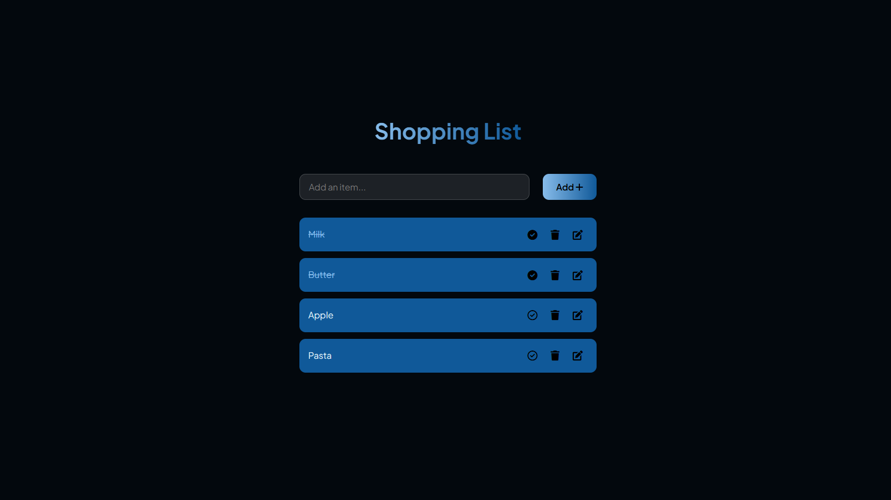
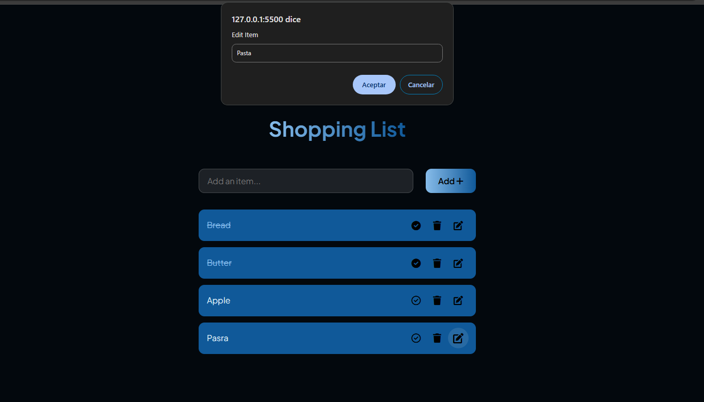
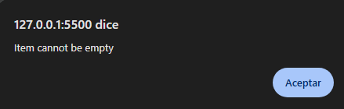
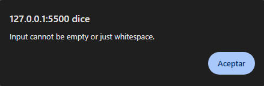
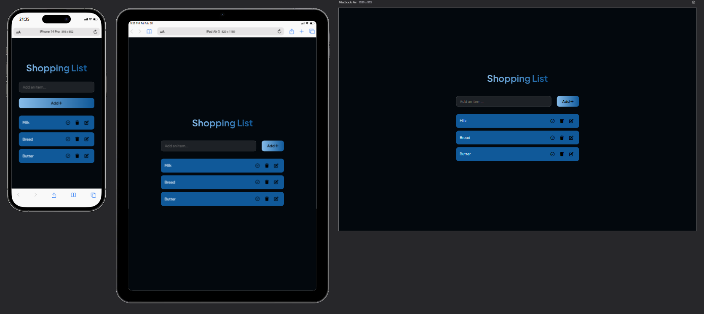

# WD-PRAC-5
Interactive task list using JavaScript and DOM manipulation.

## Description
This practice is a simple shopping list manager website that allows users to add, edit, check off and delete items, while including validations to ensure that users cannot add or edit items with empty strings.

## Features
- The website is dinamically rendered with JavaScript. 
- Includes interactive buttons. 
- There's a few default items to demostrate functionality.
- Error handling: If users attempt to add or edit an item with an empty string, an error alert message will be displayed.
- The website is visually appealing for the users.

## Images
- Add new items:

- Edit items:

- Validation when the user is trying to enter a empty string:

- Validation when the user enters an empty string while editing an item:

- Responsive UI: 

## Links
**References**

- [Button idea](https://uiverse.io/mrhyddenn/moody-badger-62)

**Github**

- [GitHub Repository](https://github.com/faiyamm/WD-PRAC-5)